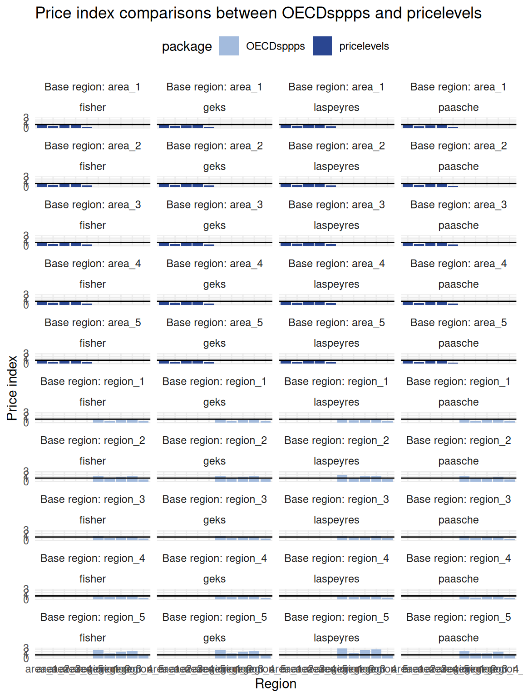

# Estimation

``` r

library(dplyr)
library(tidyr)
library(purrr)
library(stringr)
library(tibble)
library(gt)
library(ggplot2)
library(OECDsppps)
library(pricelevels)
library(data.table)
```

## Overview

**The estimation** of subnational PPPs (sPPPs) starts with the
item-level prices that are progressively aggregated to higher levels. In
addition to aggregate subnational price indices, sub-indices, for
example, at the COICOP division level, can highlight more granular
regional price level differences. This process aligns with current
recommendations; see ICP ([2021](#ref-icp2021)), Bank
([2013](#ref-worldbank2013)) and European Union/OECD
([2024](#ref-europeanunionEurostatOECDMethodologicalManual2024)) for
more information.

### Estimation steps

The estimation steps are:

1.  [Estimation of basic headings using item-level prices](#sec-step1),
    where price data are aggregated up to the level of basic headings,
    generally without the use of expenditure weights (unless such
    information is available, for instance, when retail scanner data
    provide detailed transaction-level records).

2.  [Estimation of higher-level aggregates using basic heading
    indices](#sec-step2) to higher levels of the classification
    hierarchy, at which point household expenditure data are accessible
    and can be applied as weighting factors.

To seamlessly combine the two estimation steps, `OECDsppps`, provides
the ‘linking function’
[`estim_index_link()`](https://amannj.github.io/OECDsppps/reference/estim_index_link.md)
to impute missing basic-heading subnational PPPs. A complete sylised
workflow is described in section [Putting it all
together](#sec-combined).

### Estimation methods

The choice of estimation method depends on the availability of data and
the analytical objectives of the subnational PPP exercise. When the aim
is to ensure cross-country comparability and to exploit micro-level
price information, the **Country-Product-Dummy - Gini-Éltetö-Köves-Szulc
(CPD-GEKS)** approach offers a flexible framework for estimating
basic-heading indices ([ICP 2021](#ref-icp2021)), where the first
estiation step to the basic-heading level is performed using the CPD
method, and further aggregation beyond the basic-heading level is
carried out using GEKS. Basic-heading aggregation with CPD is
recommended by the ICP ([ICP 2021](#ref-icp2021)) as it is better-suited
to handling missing price observations in the underlying price microdata
than GEKS ([Auer, Ludwig von 2026](#ref-auer_von_gap_2026)).[^1]

In contrast, the **Eurostat-OECD (Jevons-GEKS)** method employed at the
national level imposes more stringent data requirements. Such
requirements may be more difficult to meet in the context of deriving
subnational PPPs based on existing microdata, particularly regarding the
representativeness of individual products across all regions ([European
Union/OECD
2024](#ref-europeanunionEurostatOECDMethodologicalManual2024)).

The estimation procedure in this vignette follows the CPD-GEKS approach
and highlights its similarities and differences with the Jevons-GEKS
approach whenever instructive. For a more comprehensive discussion on
price indices see Bank ([2013](#ref-worldbank2013)) and European
Union/OECD
([2024](#ref-europeanunionEurostatOECDMethodologicalManual2024)).

------------------------------------------------------------------------

## 1 Estimation of basic headings using item-level prices

### 1.1 Overview

The CPD method is a regression-based approach for estimating price
parities. The underlying statistical model is

\\p\_{ij} = PPP_j \times p_i \times \epsilon\_{ij} \tag{1}\\

where \\PPP_j\\ is the purchasing power parity of an arbitrary region
\\j\\, (\\r = 1,...,j,...,R\\), \\p_i\\ is the average cross-regional
price of the same arbitrary commodity \\i\\, (\\n = 1, ..., i, ... N\\),
and \\\epsilon\_{ij}\\ is an independently and identically distributed
random variable.[^2] Taking logs of [Equation 1](#eq-ppp1) yields

\\\begin{aligned} ln p\_{ij} & = ln PPP_j + ln p_i + ln \epsilon\_{ij}
\\ & = \alpha_j + \gamma_i + ln \varepsilon\_{ij} \end{aligned}
\tag{2}\\

where \\\alpha_j\\ is the price level of region \\j\\ relative to all
other regions in the comparison. \\\alpha_j\\ can also be expressed
relative to a reference region, for example, the national price level.
Then, \\\alpha_j\\ represents the subnational purchasing power parity of
region \\j\\ given by \\\hat{PPP}\_j = exp(\hat{\alpha}\_j)\\.

### 1.2 Estimation

The CPD model in [Equation 2](#eq-ppp2) may be interpreted as a
fixed-effects specification, in which the region effects yield estimates
of subnational Purchasing Power Parities, while commodity-specific
effects generate estimates of subnational price levels. The model can be
written as a regression equation in which all explanatory variables take
the form of dummy indicators for each region and commodity.

\\\begin{aligned} ln p\_{ij} = & \alpha_1 D_1 + ... + \alpha_j D_j + ...
+\alpha_R D_R + \\ & \eta_1 \mathcal{D}\_1 + ... + \eta_i
\mathcal{D}\_i + ... + \eta_N \mathcal{D}\_N + \varepsilon\_{ij}
\end{aligned} \tag{3}\\

and \\\varepsilon\_{ij}\\ are independently and identically (normally)
distributed with a zero mean and variance \\\sigma^2\\, that is,
\\\varepsilon\_{ij} \sim N(0, \sigma^2)\\. The variables of interest,
\\PPP_j\\, can be estimated through the parameters \\\hat{\alpha}\_j\\
using ordinary least squares (OLS).

### 1.3 Implementation

This section describes the implementation of the CPD using different
approaches from simple cross-tabulations, standard OLS as well as using
the `pricelevels` package ([Weinand 2025](#ref-pricelevels)) and finally
the function
[`estim_cpd()`](https://amannj.github.io/OECDsppps/reference/estim_cpd.md)
of this package using examples [1](#sec-example1) and
[2](#sec-example2).

Examples [3](#sec-example3) to [6](#sec-example6) discuss further
functionalities of
[`estim_cpd()`](https://amannj.github.io/OECDsppps/reference/estim_cpd.md).

------------------------------------------------------------------------

#### Example 1: One product, two regions

#### 1.3.1 Using cross-tabulations

``` r

# Data
df1 <- data.table(
  region = as.factor(c(1, 2, 1, 2)),
  product = as.factor(c(1, 1, 1, 1)),
  price = c(25, 28, 23, 26)
)
```

In the CPD regression model, the intercept corresponds to the
cross-regional average.

``` r

# Calculate cross-regional price average
df1 |>
  as_tibble() |>
  summarise(mean(price))
#> # A tibble: 1 × 1
#>   `mean(price)`
#>           <dbl>
#> 1          25.5
log(25.5)
#> [1] 3.238678
```

The coefficient estimate is the price ratio of the average regional
prices.

``` r

# Calculate regional price averages and price relative
df1 |>
  as_tibble() |>
  group_by(region) |>
  summarise(mean(price))
#> # A tibble: 2 × 2
#>   region `mean(price)`
#>   <fct>          <dbl>
#> 1 1                 24
#> 2 2                 27
27 / 24
#> [1] 1.125
```

#### 1.3.2 Using `pricelevels`

The same results can be obtained using
[`cpd()`](https://rdrr.io/pkg/pricelevels/man/cpd.html) from the
`pricelevels` package.

``` r

# With pricelevels - estimation with respect to regional average
df1[, cpd(p = price, r = region, n = product, q = NULL, base = NULL)]
#>        1        2 
#> 0.942809 1.060660
1.060660 / 0.942809
#> [1] 1.125

# With pricelevels - estimation with respect to region 1
df1[, cpd(p = price, r = region, n = product, q = NULL, base = "1")]
#>     1     2 
#> 1.000 1.125

# With pricelevels - estimation output
df1[, cpd(
  p = price, r = region, n = product, q = NULL, base = NULL,
  simplify = FALSE
)]
#> 
#> Call:
#> stats::lm(formula = cpd_mod, data = pdata, singular.ok = FALSE)
#> 
#> Coefficients:
#> (Intercept)        lnP.1  
#>     3.23695     -0.05889
exp(-0.05889)
#> [1] 0.9428105
```

#### 1.3.3 Using standard OLS

The same can be achieved with a simple OLS regression

``` r

# With OLS
pdata <- df1

# Model: add intercept to for price levels relative to base
cpd_mod <- log(price) ~ region + 1

# Transformation: equiv to "mean centring" of continuous predictor: shifting
## dummy encoding to -1/1 intercept is mean across all prices.
## Region1 is the 'main effect', i.e., the difference between levels of a given
## factor (region) across all other factors.
contrasts(x = pdata$region) <- contr.sum(levels(pdata$region))
colnames(contrasts(x = pdata$region)) <- levels(pdata$region)[-nlevels(pdata$region)]

# OLS regression
out <- lm(formula = cpd_mod, data = pdata)
out
#> 
#> Call:
#> lm(formula = cpd_mod, data = pdata)
#> 
#> Coefficients:
#> (Intercept)      region1  
#>     3.23617     -0.05898
exp(dummy.coef(out)[["region"]])
#>        1        2 
#> 0.942723 1.060757
exp(3.23617 - 0.05898)
#> [1] 23.97928
exp(3.23617 + 0.05898)
#> [1] 26.98146
```

#### Example 2: Two products, two regions

The procedure is identical for the more general case.

``` r

# Data
df2 <- data.table(
  region = as.factor(c(1, 2, 1, 2)),
  product = as.factor(c(1, 1, 2, 2)),
  price = c(25, 28, 23, 26)
)
```

#### 1.3.4 Using `pricelevels`

``` r

# With pricelevels ------
## Estimation with respect to regional average
df2[, cpd(p = price, r = region, n = product, q = NULL, base = NULL)]
#>        1        2 
#> 0.942723 1.060757
1.060757 / 0.942723
#> [1] 1.125205

## Estimation with respect to region 1
df2[, cpd(p = price, r = region, n = product, q = NULL, base = "1")]
#>        1        2 
#> 1.000000 1.125205

## Estimation output
df2[, cpd(
  p = price, r = region, n = product, q = NULL, base = NULL,
  simplify = FALSE
)]
#> 
#> Call:
#> stats::lm(formula = cpd_mod, data = pdata, singular.ok = FALSE)
#> 
#> Coefficients:
#>     pi.1      pi.2     lnP.1  
#>  3.27554   3.19680  -0.05898
exp(-0.05898)
#> [1] 0.9427256
```

#### 1.3.5 Using standard OLS

``` r

# OLS ------
## Data
pdata <- df2
## Model
cpd_mod <- log(price) ~ product + region - 1

## Transformation: equiv to "mean centring"
contrasts(x = pdata$region) <- contr.sum(levels(pdata$region))
colnames(contrasts(x = pdata$region)) <- levels(pdata$region)[-nlevels(pdata$region)]

## OLS regression
out <- lm(formula = cpd_mod, data = pdata)
out
#> 
#> Call:
#> lm(formula = cpd_mod, data = pdata)
#> 
#> Coefficients:
#> product1  product2   region1  
#>  3.27554   3.19680  -0.05898
exp(dummy.coef(out)[["region"]])
#>        1        2 
#> 0.942723 1.060757
```

------------------------------------------------------------------------

#### 1.3.6 Integration in using `estim_cpd()`

provides the function
[`estim_cpd()`](https://amannj.github.io/OECDsppps/reference/estim_cpd.md)
for CPD estimation. The function provides nummerically identical results
as the previously discussed estimations and provides further
functionalities; see the examples below as well as the documentation of
[`estim_cpd()`](https://amannj.github.io/OECDsppps/reference/estim_cpd.md)
for more information.

##### Example 3: Multiple products and regions, with and without weights

CPD with no weights using
[`cpd()`](https://rdrr.io/pkg/pricelevels/man/cpd.html) in `pricelevels`
([Weinand 2025](#ref-pricelevels)) and
[`estim_cpd()`](https://amannj.github.io/OECDsppps/reference/estim_cpd.md).

``` r

# Estimating sPPPs with `pricelevels`, no weights --------
as.data.table(sampledata_prices)[, cpd(p = price, r = region, n = product)]
#>  region_1  region_2  region_3  region_4  region_5 
#> 1.1970918 1.0000753 0.9599226 1.1393190 0.7637624

# Estimating sPPPs with `estim_cpd()`, no weights ---------
sampledata_prices |>
  estim_cpd(
    region = "region",
    product = "product",
    price = "price"
  ) |>
  pull("sPPP")
#>  region_1  region_2  region_3  region_4  region_5 
#> 1.1970918 1.0000753 0.9599226 1.1393190 0.7637624
```

CPD with weights using
[`cpd()`](https://rdrr.io/pkg/pricelevels/man/cpd.html) in `pricelevels`
([Weinand 2025](#ref-pricelevels)) and
[`estim_cpd()`](https://amannj.github.io/OECDsppps/reference/estim_cpd.md).

``` r

# Combining sample price quotes and weights into one data object
sampledata <- sampledata_prices |>
  left_join(sampledata_weights)
#> Joining with `by = join_by(heading, region)`

# Estimating sPPPs with `pricelevels`, with weights --------
as.data.table(sampledata)[, cpd(p = price, r = region, n = product, w = exp_wght)]
#>  region_1  region_2  region_3  region_4  region_5 
#> 1.4407151 0.8344869 1.1247738 1.3042019 0.5670121

# Estimating sPPPs with `estim_cpd()`, with weights ---------
sampledata |>
  estim_cpd(
    region = "region",
    product = "product",
    price = "price",
    weights_cpd = "exp_wght"
  ) |>
  pull("sPPP")
#>  region_1  region_2  region_3  region_4  region_5 
#> 1.4407151 0.8344869 1.1247738 1.3042019 0.5670121
```

##### Example 4: Complete regression output

The function
[`estim_cpd()`](https://amannj.github.io/OECDsppps/reference/estim_cpd.md)
also has the option to export extended regression output of the CPD
model with argument `output = "Full"`, which summarises the key
information of the estimated CPD model: It provides the ‘Regression
output’ as well as the individual ‘Residuals’ of the CPD regression.

Information in the extended regression output is used to support the
validation of CPD-based subnational PPPs at the basic-heading level; see
[Validation](https://amannj.github.io/OECDsppps/articles/Validation.html#sec-tobh)
vignette.

``` r

# Estimating sPPPs with `estim_cpd()` ---------
full_est <- sampledata_prices |>
  estim_cpd(
    region = "region",
    product = "product",
    price = "price",
    output = "Full"
  )

## Regression output
full_est[["Regression output"]] |>
  gt() |>
  fmt_number(decimals = 2) |>
  sub_missing(missing_text = "")
```

[TABLE]

``` r


## Residuals
full_est[["Residuals"]] |>
  head() |>
  gt() |>
  fmt_number(decimals = 4) |>
  sub_missing(missing_text = "")
```

| region   | .fitted | .resid  | .std.resid |
|----------|---------|---------|------------|
| region_1 | 2.8573  | 0.7165  | 1.0428     |
| region_2 | 2.6774  | −0.2256 | −0.3283    |
| region_3 | 2.6365  | −0.7991 | −1.1630    |
| region_4 | 2.8078  | 0.0820  | 0.1194     |
| region_5 | 2.4079  | 0.2262  | 0.3292     |
| region_1 | 3.1495  | −0.2356 | −0.3428    |

##### Example 5: Duplicate region-product price pairs defaults

By default,
[`estim_cpd()`](https://amannj.github.io/OECDsppps/reference/estim_cpd.md)
aggregates the price quotes up to region-product pairs using unweighted
means whenever there are duplicate region-product pairs found in data
and no weights provided. This is identical to the behaviour of
[`cpd()`](https://rdrr.io/pkg/pricelevels/man/cpd.html) in `pricelevels`
.

``` r

# Estimating sPPPs with `estim_cpd()` ---------
sampledata_multi_period |>
  estim_cpd(
    region = "region",
    product = "product",
    price = "price"
  ) |>
  pull(sPPP)
#> Duplicate region-product pairs found in data and no weights provided: Data is aggregated to region-product pairs using unweighted means.
#>  region_1  region_2  region_3  region_4  region_5 
#> 0.8147020 0.9487813 1.0192098 1.2466297 1.0182022

# Estimating sPPPs with `pricelevels` --------
as.data.table(sampledata_multi_period)[, cpd(p = price, r = region, n = product)]
#> Warning: Duplicated observations found and aggregated
#>  region_1  region_2  region_3  region_4  region_5 
#> 0.8147020 0.9487813 1.0192098 1.2466297 1.0182022
```

##### Example 6: Duplicate region-product price pairs with aggregation weights

[`estim_cpd()`](https://amannj.github.io/OECDsppps/reference/estim_cpd.md)
also provides the option to add aggregation weight in case duplicate
region-product pairs found in data through the `weights` argument; see
[`estim_cpd()`](https://amannj.github.io/OECDsppps/reference/estim_cpd.md)
for more information.

``` r

# Estimating sPPPs with `estim_cpd()`, with aggregation weights ---------
## No weights
sampledata_prices |>
  mutate(w = 1) |>
  estim_cpd(weights = "w") |>
  pull("sPPP")
#>  region_1  region_2  region_3  region_4  region_5 
#> 1.1970918 1.0000753 0.9599226 1.1393190 0.7637624

## Random weights
set.seed(123)
sampledata_prices |>
  mutate(w = runif(nrow(sampledata_prices))) |>
  estim_cpd(weights = "w") |>
  pull("sPPP")
#>  region_1  region_2  region_3  region_4  region_5 
#> 1.1970918 1.0000753 0.9599226 1.1393190 0.7637624

## Generic sample weights
sampledata_prices |>
  left_join(sampledata_weights) |>
  estim_cpd(weights = "exp_wght") |>
  pull("sPPP")
#> Joining with `by = join_by(heading, region)`
#>  region_1  region_2  region_3  region_4  region_5 
#> 1.1970918 1.0000753 0.9599226 1.1393190 0.7637624
```

##### Example 7: Duplicate region-product price pairs without aggregation

[`estim_cpd()`](https://amannj.github.io/OECDsppps/reference/estim_cpd.md)
also provides the option to run the CPD method on the raw data, that is,
keeping duplicate region-product pairs found in the raw data by setting
the `weights` argument to `'raw'`; see
[`estim_cpd()`](https://amannj.github.io/OECDsppps/reference/estim_cpd.md)
for more information.

``` r

sampledata_prices |>
  mutate(w = runif(nrow(sampledata_prices))) |>
  estim_cpd(weights = "raw") |>
  pull("sPPP")
#> Duplicate region-product pairs found in data and `weights == 'raw'`: Raw data is used with no additional aggregation to region-product pairs.
#>  region_1  region_2  region_3  region_4  region_5 
#> 1.1970918 1.0000753 0.9599226 1.1393190 0.7637624
```

------------------------------------------------------------------------

## 2 Estimation of higher-level aggregates using basic heading indices

### 2.1 Overview

Aggregation beyond the basic-heading level uses the
Gini-Éltetö-Köves-Szulc index (GEKS) and is implemented using function
[`index_geks()`](https://amannj.github.io/OECDsppps/reference/index_geks.md).

The GEKS method is constructed based on Fisher, Laspeyres and Paasche
price indices. These index calculations are integrated in
[`index_geks()`](https://amannj.github.io/OECDsppps/reference/index_geks.md),
but the separate indices can also be calculated separately using the
functions
[`index_laspeyres()`](https://amannj.github.io/OECDsppps/reference/index_laspeyres.md),
[`index_paasche()`](https://amannj.github.io/OECDsppps/reference/index_paasche.md)
and
[`index_fisher()`](https://amannj.github.io/OECDsppps/reference/index_fisher.md).

### 2.2 Indices

#### Gini-Éltetö-Köves-Szulc index (GEKS)

The Gini-Éltetö-Köves-Szulc index (GEKS) method is recommended for
aggregating above the basic-heading levels for international and
interregional comparisons, as it satisfies the necessary properties for
multilateral comparisons; see ICP ([2021](#ref-icp2021)), Bank
([2013](#ref-worldbank2013)) and European Union/OECD
([2024](#ref-europeanunionEurostatOECDMethodologicalManual2024)) for
more information.

Subnational PPPs for region \\k\\ with reference to region \\j\\ are
calculated using the GEKS as

\\sPPP\_{GEKS}^{j,k} = \prod\_{r=1}^R \left( sPPP_F^{j,r} \times
sPPP_F^{r,k} \right)^{1/R}\\

and correspond to the geometric average of the [Fisher
indices](#sec-fisher) of all direct comparisons between region \\j\\ and
region \\k\\, and indirect comparisons across all regions \\R\\
(\\r=1,\dots,j,k,\dots,R\\).

The Gini-Éltetö-Köves-Szulc index (GEKS) is implemented through function
[`index_geks()`](https://amannj.github.io/OECDsppps/reference/index_geks.md).

#### Fisher index

For the two arbitrary regions \\j\\ and \\k\\, the Fisher index
calculates the subnational PPPs for the geometric mean of the weighted
basic heading \\b\\, \\b = 1,\dots, B\\, of the [Laspeyres
index](#sec-geks), which holds quantities in region \\j\\ constant and
allows prices to change, and the [Paasche index](#sec-geks), which holds
quantities in region \\k\\ constant and allows prices to change.

\\sPPP_F^{j,k} = \left( sPPP_L^{j,k} \times sPPP_P^{j,k} \right)^{1/2}\\
{#eq-fish}

The Fisher index is calculated based on the results estimated at the
basic heading level, where \\p\_{jk}\\ and \\e\_{jk}\\, respectively,
denote the price and associated expenditure for an arbitrary basic
heading \\b\\ and region \\r\\, and the implied quantity, \\q\_{br}\\,
is given by \\q\_{br} = \frac{e\_{br} }{ p\_{br}}\\:

\\sPPP_F^{j,k} = \left\[ \underbrace{ \frac{\sum\_{b = 1}^B
p\_{bk}q\_{bj}}{\sum\_{b = 1}^B p\_{bj}q\_{bj}} }\_{sPPP_L^{j,k}} \times
\underbrace{ \frac{\sum\_{b = 1}^B p\_{bk}q\_{bk}}{\sum\_{b = 1}^B
p\_{bj}q\_{bk}} }\_{sPPP_P^{j,k}} \right\]^{1/2}\\

The Fisher index is implemented through function
[`index_fisher()`](https://amannj.github.io/OECDsppps/reference/index_fisher.md).

#### Laspeyres index

The Laspeyres index evaluates how much the given consumer basket in base
region \\j\\ would cost if the basket were priced at partner region
\\k\\’s prices.

The Laspeyres is calculated as

\\sPPP_L^{j,k} = \sum\_{n=1}^N w_n^j \times sPPP_n^{j,k} \tag{4}\\

The Laspeyres index is implemented using function
[`index_laspeyres()`](https://amannj.github.io/OECDsppps/reference/index_laspeyres.md).

#### Paasche index

The same logic is mirrored with the Paasche index, where region \\k\\’s
basket is evaluated and compared with region \\j\\’s price. The Paasche
index is calculated as

\\sPPP_P^{j,k} = \frac{1}{\sum\_{n=1}^{N} \frac{w_n^k}{sPPP_n^{j,k}}}\\
{#eq-paas}

The Paasche index is implemented using function
[`index_paasche()`](https://amannj.github.io/OECDsppps/reference/index_paasche.md).

### 2.3 Implementation

This section illustrates the calculation of Laspeyres, Paasche, Fisher,
and GEKS indices using the
[`index_laspeyres()`](https://amannj.github.io/OECDsppps/reference/index_laspeyres.md),
[`index_paasche()`](https://amannj.github.io/OECDsppps/reference/index_paasche.md),
[`index_fisher()`](https://amannj.github.io/OECDsppps/reference/index_fisher.md),
[`index_geks()`](https://amannj.github.io/OECDsppps/reference/index_geks.md)
in `OECDsppps`.

It also illustrates the calculations of the same indices in the
`pricelevels` package ([Weinand 2025](#ref-pricelevels)).

For this, some generic CPD estimates are generated first.

``` r

# Calculate generic CPD estimates
cpd_oecd <- sampledata_prices %>%
  dplyr::select(heading, region, product, price) %>%
  group_by(heading) %>%
  group_modify(~ {
    estim_cpd(.x,
      region = "region",
      product = "product",
      price = "price",
      output = "sPPP"
    )
  }) %>%
  ungroup() %>%
  left_join(
    sampledata_weights[, c("region", "heading", "exp_wght")] %>%
      distinct(region, heading, .keep_all = TRUE),
    by = c("heading", "region")
  )
```

#### 2.3.1 Price indices in `OECDsppps`

The different price indices can be calculated through the functions
[`index_laspeyres()`](https://amannj.github.io/OECDsppps/reference/index_laspeyres.md),
[`index_paasche()`](https://amannj.github.io/OECDsppps/reference/index_paasche.md),
[`index_fisher()`](https://amannj.github.io/OECDsppps/reference/index_fisher.md)
and
[`index_geks()`](https://amannj.github.io/OECDsppps/reference/index_geks.md),
and take identical input arguments.

Note that the
[`reframe()`](https://dplyr.tidyverse.org/reference/reframe.html)
function, from package `dplyr` ([Wickham et al. 2026](#ref-refdplyr)),
in the code chunk below creates a new data frame around the returned set
of index estimates. This is useful if the separate indices should be
returned together; however, it is not necessary to calculate all these
indices separately to implement the GEKS method, as
[`index_geks()`](https://amannj.github.io/OECDsppps/reference/index_geks.md)
carries out all necessary calculation steps.

In other words,
[`index_geks()`](https://amannj.github.io/OECDsppps/reference/index_geks.md)
nests the functions
[`index_fisher()`](https://amannj.github.io/OECDsppps/reference/index_fisher.md),
[`index_laspeyres()`](https://amannj.github.io/OECDsppps/reference/index_laspeyres.md)
and
[`index_paasche()`](https://amannj.github.io/OECDsppps/reference/index_paasche.md),
respectively, as discussed in the [Indices](#sec-step2Indices) section.

``` r

indices_oecdsppps_df <- cpd_oecd %>%
  reframe(
    index_laspeyres(
      data = .,
      region = "region",
      product = "heading",
      ppp_bh = "sPPP",
      exp_wght = "exp_wght"
    ),
    index_paasche(
      data = .,
      region = "region",
      product = "heading",
      ppp_bh = "sPPP",
      exp_wght = "exp_wght"
    ),
    index_fisher(
      data = .,
      region = "region",
      product = "heading",
      ppp_bh = "sPPP",
      exp_wght = "exp_wght"
    ),
    index_geks(
      data = .,
      region = "region",
      product = "heading",
      ppp_bh = "sPPP",
      exp_wght = "exp_wght"
    )
  ) %>%
  pivot_longer(!c(base_region, region),
    names_to = "index_type",
    values_to = "index_value"
  ) %>%
  mutate(package = "OECDsppps")
```

#### 2.3.2 Price indices in `pricelevels`

The same index calculations can be carried out with the `pricelevels`
package ([Weinand 2025](#ref-pricelevels)), which is built on the
`data.table` ([Barrett et al. 2026](#ref-datatable)) library.

``` r

cpd_oecd_pl <- cpd_oecd %>%
  dplyr::select(heading, region, sPPP, exp_wght) %>%
  as.data.table()

regions_v <- c("area_1", "area_2", "area_3", "area_4", "area_5")

laspeyres_pl <- vector("list", 5)
paasche_pl <- vector("list", 5)
fisher_pl <- vector("list", 5)
geks_pl <- vector("list", 5)

names(laspeyres_pl) <- regions_v
names(paasche_pl) <- regions_v
names(fisher_pl) <- regions_v
names(geks_pl) <- regions_v


for (i in seq_along(regions_v)) {
  laspeyres_pl[[i]] <- cpd_oecd_pl[, laspeyres(
    p = sPPP,
    r = region,
    n = heading,
    w = exp_wght,
    base = c(regions_v[i])
  )]
  paasche_pl[[i]] <- cpd_oecd_pl[, paasche(
    p = sPPP,
    r = region,
    n = heading,
    w = exp_wght,
    base = c(regions_v[i])
  )]
  fisher_pl[[i]] <- cpd_oecd_pl[, fisher(
    p = sPPP,
    r = region,
    n = heading,
    w = exp_wght,
    base = c(regions_v[i])
  )]
  geks_pl[[i]] <- cpd_oecd_pl[, geks(
    p = sPPP,
    r = region,
    n = heading,
    w = exp_wght,
    settings = list(type = "fisher"),
    base = c(regions_v[i])
  )]
}
#> Warning: Base region not found -> reset to base='region_1'
#> Warning: Base region not found -> reset to base='region_1'
#> Warning: Base region not found -> reset to base='region_1'
#> Warning: Base region not found -> reset to base='region_1'
#> Warning: Base region not found -> reset to base='region_1'
#> Warning: Base region not found -> reset to base='region_1'
#> Warning: Base region not found -> reset to base='region_1'
#> Warning: Base region not found -> reset to base='region_1'
#> Warning: Base region not found -> reset to base='region_1'
#> Warning: Base region not found -> reset to base='region_1'
#> Warning: Base region not found -> reset to base='region_1'
#> Warning: Base region not found -> reset to base='region_1'
#> Warning: Base region not found -> reset to base='region_1'
#> Warning: Base region not found -> reset to base='region_1'
#> Warning: Base region not found -> reset to base='region_1'
#> Warning: Base region not found -> reset to base='region_1'
#> Warning: Base region not found -> reset to base='region_1'
#> Warning: Base region not found -> reset to base='region_1'
#> Warning: Base region not found -> reset to base='region_1'
#> Warning: Base region not found -> reset to base='region_1'


indices_pricelevels_df <- do.call(cbind, laspeyres_pl) %>%
  as_tibble() %>%
  rownames_to_column(var = "region") %>%
  pivot_longer(!region,
    names_to = "base_region",
    values_to = "laspeyres_index"
  ) %>%
  left_join(
    do.call(cbind, paasche_pl) %>%
      as_tibble() %>%
      rownames_to_column(var = "region") %>%
      pivot_longer(!region,
        names_to = "base_region",
        values_to = "paasche_index"
      ),
    by = c("base_region", "region")
  ) %>%
  left_join(
    do.call(cbind, fisher_pl) %>%
      as_tibble() %>%
      rownames_to_column(var = "region") %>%
      pivot_longer(!region,
        names_to = "base_region",
        values_to = "fisher_index"
      ),
    by = c("base_region", "region")
  ) %>%
  left_join(
    do.call(cbind, geks_pl) %>%
      as_tibble() %>%
      rownames_to_column(var = "region") %>%
      pivot_longer(!region,
        names_to = "base_region",
        values_to = "geks_index"
      ),
    by = c("base_region", "region")
  ) %>%
  pivot_longer(!c(base_region, region),
    names_to = "index_type",
    values_to = "index_value"
  ) %>%
  mutate(
    region = paste("area", region, sep = "_"),
    package = "pricelevels"
  )
```

#### 2.3.3 Comparing `OECDsppps` and `pricelevels` price indices outputs

The various indices calculated across both packages are numerically
identical.

``` r

indices_oecdsppps_df %>%
  bind_rows(indices_pricelevels_df) %>%
  mutate(
    index_type = str_remove_all(index_type, "_index"),
    base_region = paste("Base region:", base_region)
  ) |>
  ggplot(aes(x = region, y = index_value, fill = package)) +
  geom_bar(stat = "identity", position = "dodge") +
  labs(
    title = "Price index comparisons between OECDsppps and pricelevels",
    x = "Region",
    y = "Price index"
  ) +
  theme_minimal() +
  theme(legend.position = "top") +
  scale_fill_manual(values = c("#a3bbdd", "#2a4691")) +
  geom_hline(yintercept = 1) +
  facet_wrap(~ base_region + index_type, ncol = 4)
```



------------------------------------------------------------------------

## 3 Putting it all together: Estimating weighted higher-level aggregates directly from item-level prices

As described in the
[implementation](https://amannj.github.io/OECDsppps/articles/Implementation.html)
section, the CPD-GEKS approach is recommended for producing subnational
PPPs by the ICP ([ICP 2021](#ref-icp2021)), and has also been used by a
national statistical institute in a subnational PPP programme, providing
experimental statistics in Italy ([Istat 2026](#ref-Istat)).

This section describes how to implement this [two-step
procedure](https://amannj.github.io/OECDsppps/articles/Implementation.html#fig-aggregation),
which combines:

1.  Estimation of price parities at the basic-heading level using the
    regional extension of the Country-Product-Dummy (CPD) method
    ([Summers 1973](#ref-summers1973international)).
2.  Upon validation, aggregation of BH-level parities into higher-level
    indices using the Gini-Éltetö-Köves-Szulc (GEKS) method, a
    multilateral index construction technique that ensures transitivity,
    in combination with household final consumption expenditure data as
    a weighting structure for household final consumption PPPs ([ICP
    2021](#ref-icp2021)).

Most importantly, the CPI microdata typically does not contain price
quotes for all COICOP categories, including the ones for which
cross-regional uniform prices can be assumed, such as, for example, for
used cars. However, removing products that are subject to uniform prices
from the estimation will artificially inflate the price variation for
any present category. Consider the example where a generic COICOP class
contains 10 sub-classes, of which 9 are subject to uniform prices while
one sub-class is subject to price variations. If the 9 uniform
sub-classes were to be removed from the sPPPs calculation, the remaining
sub-class with regional price variation would artificially inflate the
price variation of the entire class. It is therefore necessary to
artificially include uniform prices for all sub-aggregates contained
*within* the respective higher aggregate for which sPPPs are estimated.

This can be done with the function
[`estim_index_link()`](https://amannj.github.io/OECDsppps/reference/estim_index_link.md),
which fills in missing basic heading PPPs with a value given by the
user. The function returns a data frame containing the variables
indicating the region (“region”), basic heading (“product”),
basic-heading PPP (“ppp_bh”). Once joined with expenditure weights, this
output can be directly fed into
[`index_geks()`](https://amannj.github.io/OECDsppps/reference/index_geks.md).[^3]

The two steps above can be linked within one pipeline using the
[`estim_index_link()`](https://amannj.github.io/OECDsppps/reference/estim_index_link.md)
function.

### 3.1 CPD estimation at the basic-heading level using item-level prices

Basic heading level sPPPs can be obtained from item-level price data by
first grouping the data by basic heading with
[`group_by()`](https://dplyr.tidyverse.org/reference/group_by.html),
then applying
[`estim_cpd()`](https://amannj.github.io/OECDsppps/reference/estim_cpd.md)
to each basic heading with
[`group_modify()`](https://dplyr.tidyverse.org/reference/group_map.html).

``` r

sampledata_prices %>%
  group_by(heading) %>%
  group_modify(~ {
    estim_cpd(.x,
      region = "region",
      product = "product",
      price = "price",
      output = "sPPP"
    )
  }) %>%
  ungroup() %>%
  head() %>%
  gt() %>%
  fmt_number(decimals = 4)
```

| heading   | region   | sPPP   |
|-----------|----------|--------|
| heading_1 | region_1 | 1.0691 |
| heading_1 | region_2 | 1.3077 |
| heading_1 | region_3 | 1.0052 |
| heading_1 | region_4 | 0.7483 |
| heading_1 | region_5 | 0.9509 |
| heading_2 | region_1 | 1.0950 |

This will return a grouped tibble containing three columns: the variable
specified by
[`group_by()`](https://dplyr.tidyverse.org/reference/group_by.html) (in
this case the basic heading “group”); region (“region”), and the
subnational PPPs estimated via the CPD method (“sPPP”).

Note that the returned tibble is still grouped by the grouping variable
specified in
[`group_by()`](https://dplyr.tidyverse.org/reference/group_by.html),
which should be resolved with
[`ungroup()`](https://dplyr.tidyverse.org/reference/group_by.html)
before proceeding further.

### 3.2 Index calculation using basic-heading indices

GEKS (as well as Laspeyres, Paasche, Fisher, which are all nested within
the GEKS function) indices can be calculated by linking the previous
commands with
[`index_geks()`](https://amannj.github.io/OECDsppps/reference/index_geks.md)
(as well as
[`index_laspeyres()`](https://amannj.github.io/OECDsppps/reference/index_laspeyres.md),
[`index_paasche()`](https://amannj.github.io/OECDsppps/reference/index_paasche.md),
[`index_fisher()`](https://amannj.github.io/OECDsppps/reference/index_fisher.md))
through the
[`estim_index_link()`](https://amannj.github.io/OECDsppps/reference/estim_index_link.md)
function.

[`estim_index_link()`](https://amannj.github.io/OECDsppps/reference/estim_index_link.md)
takes a data frame containing the basic heading sPPPs provided as an
input argument `data_sppps`, and joins it with a a second data frame
(supplied via the argument `data_weights`) containing the household
expenditure weights, and gives the user the option to impute price
quotes for expenditure categories, for which household expenditure
weights are present but nor price quotes are available.

Thus,
[`estim_index_link()`](https://amannj.github.io/OECDsppps/reference/estim_index_link.md)
returns a data object with all necessary variables for the calculation
of the price indices, e.g.,
[`index_geks()`](https://amannj.github.io/OECDsppps/reference/index_geks.md).

To summarise, the complete workflow has these three steps:

1.  Grouping item-level price data by basic heading, estimating basic
    heading sPPPs, and ungrouping the output data
2.  Preparing the data with
    [`estim_index_link()`](https://amannj.github.io/OECDsppps/reference/estim_index_link.md)
    for index number calculation
3.  Estimating the final index numbers with
    [`index_laspeyres()`](https://amannj.github.io/OECDsppps/reference/index_laspeyres.md),
    [`index_paasche()`](https://amannj.github.io/OECDsppps/reference/index_paasche.md),
    [`index_fisher()`](https://amannj.github.io/OECDsppps/reference/index_fisher.md),
    and
    [`index_geks()`](https://amannj.github.io/OECDsppps/reference/index_geks.md)

``` r

sampledata_prices %>%
  # 1st step: grouping the data
  group_by(heading) %>%
  # 1st step: estimating the basic-heading sPPPs
  group_modify(~ {
    estim_cpd(.x,
      region = "region",
      product = "product",
      price = "price",
      output = "sPPP"
    )
  }) %>%
  # 1st step: ungrouping the output data
  ungroup() %>%
  # 2nd step: preparing the data for index number calculation
  estim_index_link(
    data = .,
    data_weights = sampledata_weights,
    product_heading = "heading",
    region = "region",
    sPPP = "sPPP",
    weights = "exp_wght",
    complete_sppp = NA
  ) %>%
  # 3rd step: Index number calculation
  index_geks() %>%
  # Previewing the results
  head() %>%
  gt() %>%
  fmt_number(decimals = 4)
```

| base_region | region   | geks_index |
|-------------|----------|------------|
| region_1    | region_1 | 1.0000     |
| region_1    | region_2 | 0.5915     |
| region_1    | region_3 | 0.7921     |
| region_1    | region_4 | 0.9108     |
| region_1    | region_5 | 0.4122     |
| region_2    | region_1 | 1.6905     |

### 3.3 Incomplete input data

Unfortunately, the required input data is often incomplete and requires
further processing before it can be used. Item-level price data can be
validated through
[`valid_pot()`](https://amannj.github.io/OECDsppps/reference/valid_pot.md),
[`valid_apt()`](https://amannj.github.io/OECDsppps/reference/valid_apt.md),
[`valid_ratio_xr()`](https://amannj.github.io/OECDsppps/reference/valid_ratio_xr.md),
and
[`valid_ratio_ppp()`](https://amannj.github.io/OECDsppps/reference/valid_ratio_ppp.md).
Expenditure weights can be validated through
[`valid_est()`](https://amannj.github.io/OECDsppps/reference/valid_est.md).

#### 3.3.1 Missing price quotes

Basic heading sPPPs obtained from
[`estim_cpd()`](https://amannj.github.io/OECDsppps/reference/estim_cpd.md)
may be incomplete for several reasons, such as missing price quotes for
specific regions or uniform pricing across regions. In these cases, the
above-outlined approach results in an error from
[`index_geks()`](https://amannj.github.io/OECDsppps/reference/index_geks.md)
due to an incomplete sPPP matrix.

In the example below, we remove the sPPPs for two region/basic-heading
pairs. While
[`estim_index_link()`](https://amannj.github.io/OECDsppps/reference/estim_index_link.md)
returns a harmonised data frame,
[`index_geks()`](https://amannj.github.io/OECDsppps/reference/index_geks.md)
returns an error.

Note that in the code chunk below,
[`tryCatch()`](https://rdrr.io/r/base/conditions.html) is used to print
the error message returned by
[`index_geks()`](https://amannj.github.io/OECDsppps/reference/index_geks.md)
as an output.

``` r

# Return error message ------
return_error <- function(expr) {
  tryCatch(expr,
    error = function(e) {
      message("Error message:\n", e)
    }
  )
}


return_error(
  sampledata_prices %>%
    group_by(heading) %>%
    group_modify(~ {
      estim_cpd(.x,
        region = "region",
        product = "product",
        price = "price",
        output = "sPPP"
      )
    }) %>%
    ungroup() %>%
    # Remove sPPPs for the following region/heading combinations: 1/1, 2/1
    filter(!(region %in% c("region_1", "region_2") & heading == "heading_1")) %>%
    estim_index_link(
      data_sppps = .,
      data_weights = sampledata_weights,
      product_heading = "heading",
      region = "region",
      sPPP = "sPPP",
      weights = "exp_wght",
      complete_sppp = NA
    ) %>%
    index_geks()
)
#> Error message:
#> Error in valid_index_data(data, region, product, ppp_bh, exp_wght): Incomplete PPP matrix.
#> Missing PPPs for the following region/product combinations:
#>  region_1/heading_1; region_2/heading_1
```

[`estim_index_link()`](https://amannj.github.io/OECDsppps/reference/estim_index_link.md)
enables imputing a user-specified value for missing sPPPs through the
“complete_sppp” argument. The same value is imputed for all
region/basic-heading pairs with missing sPPPs. The missing pairs are
identified by
[`estim_index_link()`](https://amannj.github.io/OECDsppps/reference/estim_index_link.md)
and do not have to be specified by the user. Below, we impute 1 for
sPPPs of all such pairs.
[`estim_index_link()`](https://amannj.github.io/OECDsppps/reference/estim_index_link.md)
also returns a warning listing all region/basic heading pairs for which
the user-provided value was imputed.

``` r

sampledata_prices %>%
  group_by(heading) %>%
  group_modify(~ {
    estim_cpd(.x,
      region = "region",
      product = "product",
      price = "price",
      output = "sPPP"
    )
  }) %>%
  ungroup() %>%
  # Remove sPPPs for the following region/heading combinations: 1/1, 2/1
  filter(!(region %in% c("region_1", "region_2") & heading == "heading_1")) %>%
  # Setting complete_sppp = 1 to impute 1 for missing sPPPs
  estim_index_link(
    data = .,
    data_weights = sampledata_weights,
    product_heading = "heading",
    region = "region",
    sPPP = "sPPP",
    weights = "exp_wght",
    complete_sppp = 1
  ) %>%
  index_geks() %>%
  head() %>%
  gt() %>%
  fmt_number(decimals = 4)
#> [1] "sPPP of 1 was imputed to the following region/headings pairs: region_1/heading_1; region_2/heading_1"
#> Warning in estim_index_link(data = ., data_weights = sampledata_weights, : sPPP
#> of 1 was imputed to the following region/headings pairs: region_1/heading_1;
#> region_2/heading_1
```

| base_region | region   | geks_index |
|-------------|----------|------------|
| region_3    | region_3 | 1.0000     |
| region_3    | region_4 | 1.1508     |
| region_3    | region_5 | 0.5205     |
| region_3    | region_1 | 1.2573     |
| region_3    | region_2 | 0.7326     |
| region_4    | region_3 | 0.8690     |

#### 3.3.2 Incomplete weighting matrix

Alternatively, the expenditure weights data frame can contain empty
fields for some region/basic-heading combinations.
[`estim_index_link()`](https://amannj.github.io/OECDsppps/reference/estim_index_link.md)
still works with such data and returns a standardised data frame.
However, this data frame contains NAs for some region/basic-heading
weights.

``` r

# Remove expenditure weight for the following region/heading combination: 1/1
sampledata_weights <- sampledata_weights %>%
  filter(!(heading %in% c("heading_1") & region %in% c("region_1")))

sampledata_prices %>%
  group_by(heading) %>%
  group_modify(~ {
    estim_cpd(.x,
      region = "region",
      product = "product",
      price = "price",
      output = "sPPP"
    )
  }) %>%
  ungroup() %>%
  estim_index_link(
    data = .,
    data_weights = sampledata_weights,
    product_heading = "heading",
    region = "region",
    sPPP = "sPPP",
    weights = "exp_wght",
    complete_sppp = NA
  ) %>%
  head() %>%
  gt() %>%
  fmt_number(decimals = 4)
```

| product   | region   | ppp_bh | exp_wght |
|-----------|----------|--------|----------|
| heading_1 | region_1 | 1.0691 | NA       |
| heading_1 | region_2 | 1.3077 | 0.0687   |
| heading_1 | region_3 | 1.0052 | 0.0687   |
| heading_1 | region_4 | 0.7483 | 0.0631   |
| heading_1 | region_5 | 0.9509 | 0.0673   |
| heading_2 | region_1 | 1.0950 | 0.0983   |

In turn, this causes the index number function to break and return an
error due to an incomplete expenditure weights matrix.

Note that in the code chunk below,
[`tryCatch()`](https://rdrr.io/r/base/conditions.html) is used to print
the error message returned by
[`index_geks()`](https://amannj.github.io/OECDsppps/reference/index_geks.md)
as an output.

``` r

return_error(
  sampledata_prices %>%
    group_by(heading) %>%
    group_modify(~ {
      estim_cpd(.x,
        region = "region",
        product = "product",
        price = "price",
        output = "sPPP"
      )
    }) %>%
    ungroup() %>%
    estim_index_link(
      data = .,
      data_weights = sampledata_weights,
      product_heading = "heading",
      region = "region",
      sPPP = "sPPP",
      weights = "exp_wght",
      complete_sppp = NA
    ) %>%
    index_geks()
)
#> Error message:
#> Error in valid_index_data(data, region, product, ppp_bh, exp_wght): 
#> Incomplete expenditure weights matrix.
#> Missing weights for the following region/product combinations:
#>  region_1/heading_1
```

  
  

------------------------------------------------------------------------

## References

Auer, Ludwig von. 2026. *The Gap Pattern Coefficient: Diagnosing
Missing-Data Bias in Multilateral Price Level Measurement*. (Trier).
<https://www.uni-trier.de/fileadmin/fb4/prof/VWL/EWF/Research_Papers/2026-09.pdf>.

Bank, World. 2013. *Measuring the Real Size of the World Economy: The
Framework, Methodology, and Results of the International Comparison
Program (ICP)*. World Bank.
<https://thedocs.worldbank.org/en/doc/927971487091799574-0050022017/original/ICPBookeBookFINAL.pdf>.

Barrett, Tyson, Matt Dowle, Arun Srinivasan, et al. 2026. *Data.table:
Extension of ‘Data.frame‘*. <https://r-datatable.com>.

European Union/OECD. 2024. *Eurostat-OECD Methodological Manual on
Purchasing Power Parities (2023 Edition)*. OECD Publishing, Paris.
<https://doi.org/10.2785/384854>.

ICP. 2021. *A Guide to the Compilation of Subnational Purchasing Power
Parities (PPPs)*.
<https://thedocs.worldbank.org/en/doc/5064f2288436664bc8f9811c8a5b8c55-0050022021/original/Guide-Subnational-PPPs.pdf>.

Istat. 2026. *Consumer Spatial Price Indices*.
<https://www.istat.it/en/experimental-statistic/consumer-spatial-price-indices/>.

Summers, Robert. 1973. “International Price Comparisons Based Upon
Incomplete Data.” *Review of Income and Wealth* 19 (1): 1–16.

Weinand, Sebastian. 2025. *Pricelevels: Spatial Price Level
Comparisons*. <https://doi.org/10.32614/CRAN.package.pricelevels>.

Wickham, Hadley, Romain François, Lionel Henry, Kirill Müller, and Davis
Vaughan. 2026. *Dplyr: A Grammar of Data Manipulation*.
<https://doi.org/10.32614/CRAN.package.dplyr>.

[^1]: This is particularly important when deriving PPPs from existing
    price microdata, where not all products are observed in every
    region, rather than from dedicated PPP surveys based on a
    pre-specified list of comparable items. In particular, GEKS
    price-level estimates are intrinsically more sensitive to missing
    observations than those obtained through CPD and therefore
    diagnostic tools for assessing data completeness are especially
    valuable for GEKS-based price-level estimates ([Auer, Ludwig von
    2026](#ref-auer_von_gap_2026)).

[^2]: Model [Equation 1](#eq-ppp1) is not identified and requires
    parametrisation before it can be estimated.

[^3]: Or any alternative bilateral index formula
    [`index_laspeyres()`](https://amannj.github.io/OECDsppps/reference/index_laspeyres.md),
    [`index_paasche()`](https://amannj.github.io/OECDsppps/reference/index_paasche.md),
    [`index_fisher()`](https://amannj.github.io/OECDsppps/reference/index_fisher.md).
