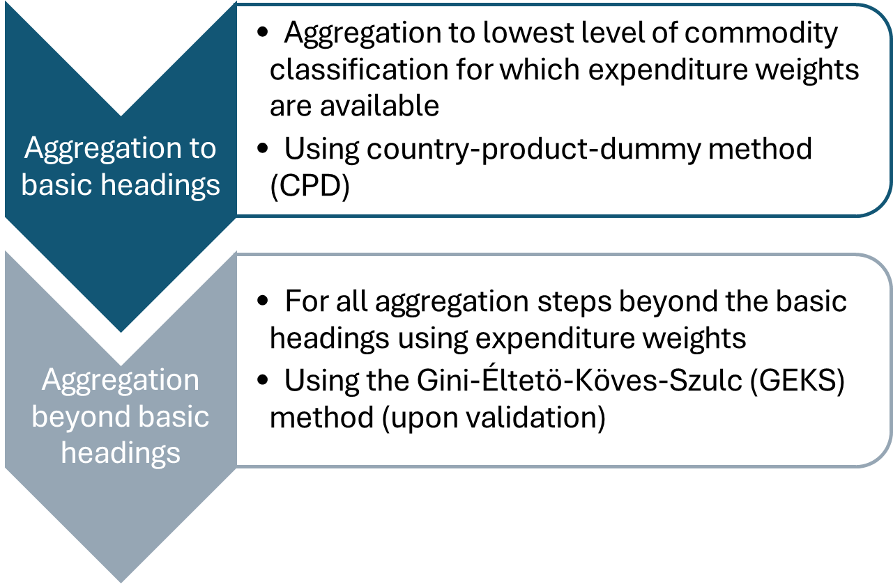

# Implementation

``` r

library(OECDsppps)
```

## Overview

### Methodology

This vignette provides a fully documented production pipeline,
describing the data, processing, validation, aggregation and estimation
of the multiple data sources for the purpose of constructing subnational
PPPs in the testing countries. Data processing, validation, aggregation,
and estimation follow the international recommendations whenever
applicable ([World Bank 2013](#ref-worldbank2013); [European Union/OECD
2024](#ref-europeanunionEurostatOECDMethodologicalManual2024); [ICP
2021](#ref-icp2021)).

In particular, the CPD-GEKS approach is recommended for producing
subnational PPPs by the ICP ([ICP 2021](#ref-icp2021)), and has also
been used by a national statistical institute in a subnational PPP
programme, providing experimental statistics in Italy ([Istat
2026](#ref-Istat)).

The approach follows a two-step procedure
([Figure 1](#fig-aggregation)):

- Estimation of price parities at the basic heading level using the
  regional extension of the Country-Product-Dummy (CPD) method ([Summers
  1973](#ref-summers1973international)).
- Upon validation, aggregation of BH-level parities into higher-level
  indices using the Gini-Éltetö-Köves-Szulc (GEKS) method, a
  multilateral index construction technique that ensures transitivity,
  in combination with household final consumption expenditure data as a
  weighting structure for household final consumption PPPs ([ICP
  2021](#ref-icp2021)).



Figure 1: Aggregation and estimation steps of subnational purchasing
power parities

### Implementation pipeline

`OECDsppps` is available in R, but section [Alternative
Software](https://amannj.github.io/OECDsppps/articles/altSoftware.html)
discusses how the package can be integrated into a Python or SAS
workflow.

The implementation pipeline covers the country-level data validation,
the aggregation and estimation of subnational purchasing power parities
and the harmonisation of these estimates to make sPPP indicators
comparable across countries ([Table 1](#tbl-implementation)).

Only the raw data validation, which derives a standard structure across
all testing countries, remains country- and dataset-specific. The
individual stages of the production pipeline are discussed in the
subsequent paragraphs, together with the various functions use for the
calculation of the subnational price indices.

| Steps | Counterpart | `OECDsPPPs` integration |
|----|----|----|
| **1** Raw data processing | OECD or country | ❌ |
| **2** Raw data validation | OECD or country | [`valid_pot()`](https://amannj.github.io/OECDsppps/reference/valid_pot.md), [`valid_apt()`](https://amannj.github.io/OECDsppps/reference/valid_apt.md), `valid_XRatio()`, [`valid_PPPratio()`](https://amannj.github.io/OECDsppps/reference/valid_PPPratio.md), [`valid_est()`](https://amannj.github.io/OECDsppps/reference/valid_est.md) |
| **3** Estimation at basic-heading level | OECD or country | [`estim_cpd()`](https://amannj.github.io/OECDsppps/reference/estim_cpd.md) |
| **4** Validation of estimation at basic-heading level | OECD or country | 🚧 *valid_dikhanov()*, *valid_plots()* |
| **5** Estimation beyond the basic-heading level | OECD | [`index_laspeyres()`](https://amannj.github.io/OECDsppps/reference/index_laspeyres.md), [`index_paasche()`](https://amannj.github.io/OECDsppps/reference/index_paasche.md), [`index_fisher()`](https://amannj.github.io/OECDsppps/reference/index_fisher.md), [`index_geks()`](https://amannj.github.io/OECDsppps/reference/index_geks.md) |
| **6** Validation of estimation beyond the basic-heading level | OECD | 🚧 *valid_plots()* |
| **7** Comparability across countries and regions | OECD | 🚧 |

Table 1: Implementation pipeline

  

## 1 Raw data processing

The objective of the raw data processing is to derive a standard
structure across all testing countries. Data are sourced primarily from
official CPI programmes of National Statistical Offices (NSOs) and are
country-specific. Consequently, data cleaning is country- and
data-specific, and typically the most time-consuming part of the initial
data work, as data can be available at different levels of granularity
(spatial and product-related), content (available variables and
information), and coverage (e.g., products, types of activity, etc.).

The data processing takes the raw (unprocessed) CPI microdata. It
ensures that product characteristics, as well as the observed quantities
and measurement units of the observed price quotes, are harmonised,
enabling a like-for-like comparison of products across regions. See
[Table 2](#tbl-example) for a stylised example based on Weinand and Auer
([Weinand and Auer 2020](#ref-weinand2020)).

| Region | Outlet | Quantity observed | Measurement unit of observed quantity | Product characteristics | Price observed |
|----|----|----|----|----|----|
| A | Supermarket | 1 | Kilograms | “Bens, basmati, bag” | 1.69 |
| C | Supermarket | 500 | Grams | “Ben’s, basmati, bulk” | 0.79 |
| B | Supermarket | 0.5 | Kilograms | “Ben, basm., bulk” | 0.69 |

Table 2: Example of consumer price microdata based on Weinand and Auer
Weinand and Auer ([2020](#ref-weinand2020))

In addition to harmonising the individual price quotes, initial data
processing also classifies the individual items or projects according to
their respective COICOP subclasses. Once a common structure is
established, harmonised data processing using `OECDsppps` commences with
the data validation.

## 2 Raw data validation

Data validation is carried out to confirm the validity of price
statistics at various levels of aggregation, from the initial item-level
price quotes to the basic heading level and upwards, as well as
comparing household expenditure weights across regions.

Validation begins with analysing item-level prices within regions and
involves outlier detections of single price quotes and average price
aggregates. The two validation steps taken at this stage are described
in the [Validation
vignette](https://amannj.github.io/OECDsppps/articles/Validation.html):

1.  [Intra-regional
    validation](https://amannj.github.io/OECDsppps/articles/Validation.html#sec-intraregional)
    analyses individual and aggregate price quotes within the same
    region and across regions of the same country
2.  [Inter-regional
    validation](https://amannj.github.io/OECDsppps/articles/Validation.html#sec-interregional)
    performs prices validation across all regions and countries,
    ensuring that average prices are based on comparable products in
    regions across countries and that products have been accurately
    priced.

The raw data [validation of alternative data
sources](https://amannj.github.io/OECDsppps/articles/Validation.html#sec-alternative)
is also carried out at this stage.

Functions used at this stage are:
[`valid_pot()`](https://amannj.github.io/OECDsppps/reference/valid_pot.md),
[`valid_apt()`](https://amannj.github.io/OECDsppps/reference/valid_apt.md),
`valid_XRatio()`,
[`valid_PPPratio()`](https://amannj.github.io/OECDsppps/reference/valid_PPPratio.md),
[`valid_est()`](https://amannj.github.io/OECDsppps/reference/valid_est.md).

## 3 Estimation at basic-heading level

[Estimation of basic
headings](https://amannj.github.io/OECDsppps/articles/Estimation.html#sec-step1)
using item-level prices, where price data are aggregated up to the level
of basic headings, generally without the use of expenditure weights.

The estimation is carried out using
[`estim_cpd()`](https://amannj.github.io/OECDsppps/reference/estim_cpd.md)
with argument `output = "Full"`, which summarises the key information of
the estimate CPD model: It provides the ‘Regression output\` as well as
the individual ’Residuals’ of the CPD regression; see [Example
4](https://amannj.github.io/OECDsppps/articles/Estimation.html#sec-example4)
in the [Estimation
vignette](https://amannj.github.io/OECDsppps/articles/Estimation.html).

## 4 Validation of estimation at basic-heading level

[Validation at the basic-heading
level](https://amannj.github.io/OECDsppps/articles/Validation.html#sec-tobh)
concerns the reliability of the CPD estimates as well as their
cross-sectional comparability. The *numerical validation* is carried out
using [Dikhanov
tables](https://amannj.github.io/OECDsppps/articles/Validation.html#dikhanov-tables-for-validation-at-basic-heading-level),
and the [visual
validation](https://amannj.github.io/OECDsppps/articles/Validation.html#visual-validation-at-basic-heading-level)
is done by way of plotting.

Functions used at this stage are: *valid_dikhanov()*, *valid_plots()*.

## 5 Estimation beyond the basic-heading level

### 5.1 Data preparation

🚧 Completion of price-quote and expenditure matrices for further
aggregation (work in progress).

### 5.2 Index calculations

The [Gini-Éltetö-Köves-Szulc index
(GEKS)](https://amannj.github.io/OECDsppps/articles/Estimation.html#sec-geks)
method is recommended for aggregating above the basic heading levels for
international and interregional comparisons, as it satisfies the
necessary properties for multilateral comparisons. It corresponds to the
geometric average of the [Fisher
indexs](https://amannj.github.io/OECDsppps/articles/Estimation.html#sec-fisher),
which, in turn, incorporates the
[Laspeyres](https://amannj.github.io/OECDsppps/articles/Estimation.html#sec-geks)
and the
[Paasche](https://amannj.github.io/OECDsppps/articles/Estimation.html#sec-geks)
index.

Functions used at this stage are:
[`index_laspeyres()`](https://amannj.github.io/OECDsppps/reference/index_laspeyres.md),
[`index_paasche()`](https://amannj.github.io/OECDsppps/reference/index_paasche.md),
[`index_fisher()`](https://amannj.github.io/OECDsppps/reference/index_fisher.md),
[`index_geks()`](https://amannj.github.io/OECDsppps/reference/index_geks.md).

## 6 Validation of estimation beyond the basic-heading level

> 🚧 Work in progress.

## 7 Comparability across countries and regions

> 🚧 Work in progress.

## References

European Union/OECD. 2024. *Eurostat-OECD Methodological Manual on
Purchasing Power Parities (2023 Edition)*. OECD Publishing, Paris.
<https://doi.org/10.2785/384854>.

ICP. 2021. *A Guide to the Compilation of Subnational Purchasing Power
Parities (PPPs)*.
<https://thedocs.worldbank.org/en/doc/5064f2288436664bc8f9811c8a5b8c55-0050022021/original/Guide-Subnational-PPPs.pdf>.

Istat. 2026. *Consumer Spatial Price Indices*.
<https://www.istat.it/en/experimental-statistic/consumer-spatial-price-indices/>.

Summers, Robert. 1973. “International Price Comparisons Based Upon
Incomplete Data.” *Review of Income and Wealth* 19 (1): 1–16.

Weinand, Sebastian, and Ludwig von Auer. 2020. “Anatomy of Regional
Price Differentials: Evidence from Micro-Price Data.” *Spatial Economic
Analysis* 15 (4): 413–40.
<https://doi.org/10.1080/17421772.2020.1729998>.

World Bank. 2013. *Measuring the Real Size of the World Economy: The
Framework, Methodology, and Results of the International Comparison
Program ICP*. World Bank.
<https://thedocs.worldbank.org/en/doc/927971487091799574-0050022017/original/ICPBookeBookFINAL.pdf>.
