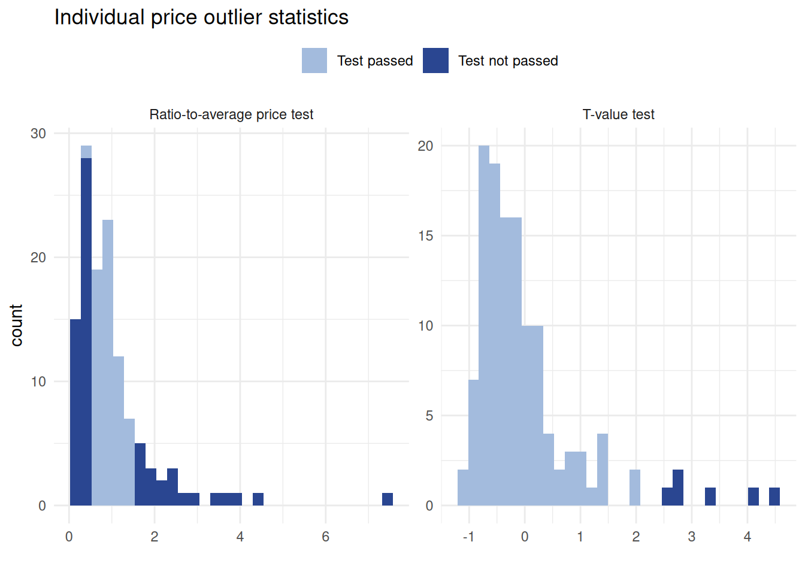
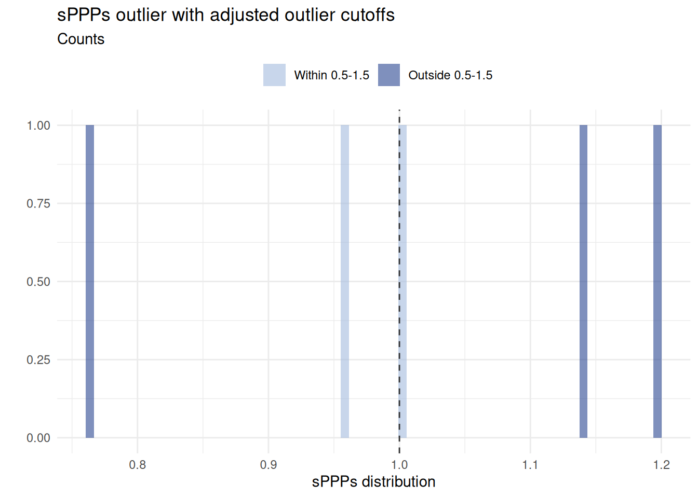
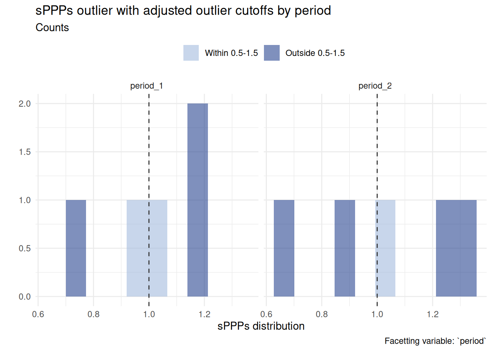
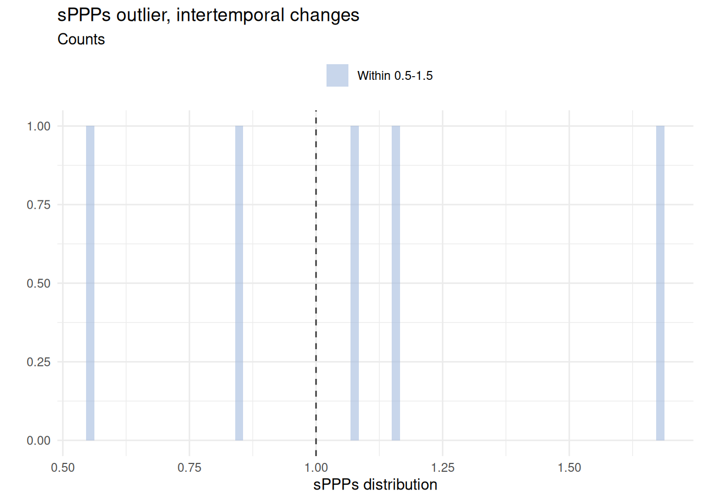

# Validation

``` r

library(OECDsppps)
library(dplyr)
library(tidyr)
library(gt)
library(ggplot2)
library(OECDsppps)
library(purrr)
```

## Overview

**Data validation** is carried out to confirm the validity of price
statistics at various levels of aggregation, from the initial item-level
price quotes to the basic-heading level and upwards, as well as
comparing household expenditure weights across regions. The process
aligns with current recommendations; see ICP ([2021](#ref-icp2021)),
Bank ([2013](#ref-worldbank2013)) and European Union/OECD
([2024](#ref-europeanunionEurostatOECDMethodologicalManual2024)) for
more information.

**The validation steps** are:

1.  [Intra-regional validation](#sec-intraregional) analyses individual
    and aggregate price quotes within the *same region* and *across
    regions of the same country*
2.  [Inter-regional validation](#sec-interregional) performs prices
    validation *across all regions and countries*, ensuring that average
    prices are based on comparable products in regions across countries
    and that products have been accurately priced.
3.  [Validation of alternative data sources](#sec-alternative) describes
    the validation process of alternative data sources
4.  [Validation at basic-heading level](#sec-tobh) covers the validation
    of price indices at the basing-heading level
5.  [Expenditure weights validation](#sec-exweights) describes the
    validation of household consumption expenditure
6.  [Validation beyond basic-heading level](#sec-beyondbh) concerns the
    validation of price indices beyond the basing-heading level

------------------------------------------------------------------------

## 1 Intra-regional validation

Intra-region validation establishes that price collectors within the
*same region* and *across regions of the same country* have priced
products that match the product specifications and that the prices they
have reported are correct. This is done in two stages, which correspond
to the outlier detection of (a) individual prices and (b) average price
aggregates.

### 1.1 Individual price outlier statistics

For each product, a *Price Observation Table* is obtained, containing a
characterisation of the individual product as well as two *individual
price outlier statistics*, the *ratio-to-average price test* and the
*t-value test*; see Bank ([2013](#ref-worldbank2013)), Table 9.1a for an
extensive example.

**Ratio-to-average price test:** The ratio of an individual price
observation \\i\\, \\P\_{i}\\, of a specific product \\j\\ and the
observed average price for the product, \\\mu_j\\. An observed price
passes this test if the ratio is between 0.5 and 1.5. This simple check
flags potential outlier values without relying on standard deviation,
which can itself be distorted by outliers ([Bank 2013,
251](#ref-worldbank2013)).

\\ratio-to-average = p\_{ij}/\mu_j\\

**T-value test:** The ratio of the deviation of an individual price
observation from the average reference quantity price for the product
and the standard deviation of the product. To pass the test, the ratio
must be 2.0 or less in absolute terms; any value greater than 2.0 is
suspect because it falls outside the 95% confidence interval.

\\t-val = (p\_{ij} - \mu\_{P_j}) / \sigma\_{P_j}\\

Individual price quotes that do not pass these tests are flagged in the
*Price Observation Table*. The *Price Observation Table* is generated
with the function
[`valid_pot()`](https://amannj.github.io/OECDsppps/reference/valid_pot.md).

------------------------------------------------------------------------

**Example using UK CPI microdata**

``` r

# Price Observation Table  ---------
sample_pot <- sampledata_prices %>%
  group_by(heading) %>%
  valid_pot(price_quote = "price") %>%
  ungroup()

head(sample_pot, n = 3) |>
  gt() |>
  tab_header(
    title = md("**Price Observation Table**")
  ) |>
  fmt_number(
    columns = c(
      `Ratio-to-average price test`,
      `T-value test`
    ),
    decimals = 2
  )
```

| **Price Observation Table** |  |  |  |  |  |  |  |
|----|----|----|----|----|----|----|----|
| heading | region | product | price | Ratio-to-average price test | T-value test | Ratio-to-average price test FLAG | T-value test FLAG |
| heading_1 | region_1 | item_01 | 35.65 | 1.35 | 0.52 | FALSE | FALSE |
| heading_1 | region_2 | item_01 | 11.61 | 0.44 | −0.82 | TRUE | FALSE |
| heading_1 | region_3 | item_01 | 6.28 | 0.24 | −1.12 | TRUE | FALSE |

``` r


# Visualisation of price distribution ---------
sample_pot |>
  select(
    heading,
    `Ratio-to-average price test`:`T-value test`
  ) |>
  pivot_longer(`Ratio-to-average price test`:`T-value test`) |>
  mutate(
    is.outlier = case_when(name == "Ratio-to-average price test" & (value < 0.5 | value > 1.5) ~ "Test not passed",
      name == "T-value test" & ((value > 2) | (value < -2)) ~ "Test not passed",
      .default = "Test passed"
    ),
    is.outlier = factor(is.outlier, levels = c("Test passed", "Test not passed"))
  ) |>
  ggplot(aes(x = value, fill = is.outlier)) +
  facet_wrap(~name, scales = "free") +
  geom_histogram(bins = 30) +
  labs(
    title = "Individual price outlier statistics",
    x = "",
    fill = ""
  ) +
  theme_minimal() +
  theme(legend.position = "top") +
  scale_fill_manual(values = c("#a3bbdd", "#2a4691"))
```



------------------------------------------------------------------------

### 1.2 Aggregate price statistics

This stage involves identifying extreme values among the average prices
of the products listed in the *Average Price Table*. An extreme value is
defined as an individual price or average price that for a given test
scores a value that falls outside a predetermined critical value and is
built on two *average price outlier statistics*, which are summarised in
the Average Price Table; see Bank ([2013](#ref-worldbank2013)), table
9.2a and 9.2b for an extensive example. The two statistics contained in
this table are the *max-min ratio test* and the *coefficient to
variation* test.

**Max-min ratio test:** The ratio between the maximal and minimal
observed price for product \\j\\. Products where the maximal observed
price is more than twice as big as the minimum are flagged

\\max-min~ratio = max(p_j)/min(p_j)\\

**Coefficient-of-variation test:** The standard deviation for the
product expressed as a percentage of the average price for the product.
Products with a coefficient of variation greater than 20% will be
flagged.

\\coefficient-of-variation: \sigma\_{p_j} / \mu\_{p_j}\\

Aggregate price quotes that do not pass these tests are flagged in the
*Average Price Table*. The *Average Price Table* is generated with the
function
[`valid_apt()`](https://amannj.github.io/OECDsppps/reference/valid_apt.md).

------------------------------------------------------------------------

**Example using UK CPI microdata**

``` r

# Average Price Table -------
sample_apt <- sampledata_prices %>%
  group_by(heading) %>%
  valid_apt(price_quote = "price")

head(sample_apt, 2) |>
  gt() |>
  tab_header(
    title = md("**Average Price Table**")
  ) |>
  fmt_number(
    decimals = 2
  )
```

| **Average Price Table** |  |  |  |  |  |  |  |  |  |
|----|----|----|----|----|----|----|----|----|----|
| heading | Number of observations | Average price of product | Maximum price of product | Minimum price of product | Standard deviation | Max-min ratio | Coefficient of variation | Max-min ratio FLAG | Coefficient of variation FLAG |
| heading_1 | 25.00 | 26.36 | 77.11 | 6.28 | 18.01 | 12.28 | 0.68 | TRUE | TRUE |
| heading_2 | 25.00 | 0.65 | 2.90 | 0.18 | 0.56 | 16.11 | 0.87 | TRUE | TRUE |

### 1.3 Linking validation pipelines for intra-regional validation

The extent of validation required depends on the quality of the
underlying microdata. When working with unconsolidated or raw data, more
extensive revisions may be necessary.

Using the two functions
[`valid_pot()`](https://amannj.github.io/OECDsppps/reference/valid_pot.md)
and
[`valid_apt()`](https://amannj.github.io/OECDsppps/reference/valid_apt.md),
a simple production pipeline can be set up which operates conditional on
the flags of the different tests.

------------------------------------------------------------------------

**Example using UK CPI microdata**

``` r

# Example for linked production pipeline  -------
sample_irv <- sampledata_prices |>
  group_by(region, heading) |>
  # Apply individual price outlier check
  valid_pot(price_quote = "price") |>
  # Condition on price quotes which pass the Price Observation Table tests
  filter(!`Ratio-to-average price test FLAG` & !`T-value test FLAG`) |>
  # Remove bimodal distribution
  filter(`Ratio-to-average price test` > 0.8) |>
  # Apply Average Price Table checks
  valid_apt(price_quote = "price")

head(sample_apt, 4) |>
  group_by(heading) |>
  gt() |>
  tab_header(
    title = md("**Average Price Table**")
  ) |>
  fmt_number(
    decimals = 1
  )
```

| **Average Price Table** |  |  |  |  |  |  |  |  |
|----|----|----|----|----|----|----|----|----|
| Number of observations | Average price of product | Maximum price of product | Minimum price of product | Standard deviation | Max-min ratio | Coefficient of variation | Max-min ratio FLAG | Coefficient of variation FLAG |
| heading_1 |  |  |  |  |  |  |  |  |
| 25.0 | 26.4 | 77.1 | 6.3 | 18.0 | 12.3 | 0.7 | TRUE | TRUE |
| heading_2 |  |  |  |  |  |  |  |  |
| 25.0 | 0.6 | 2.9 | 0.2 | 0.6 | 16.1 | 0.9 | TRUE | TRUE |
| heading_3 |  |  |  |  |  |  |  |  |
| 25.0 | 4.0 | 15.5 | 0.6 | 4.2 | 25.8 | 1.0 | TRUE | TRUE |
| heading_4 |  |  |  |  |  |  |  |  |
| 25.0 | 3.2 | 23.5 | 0.7 | 4.5 | 35.1 | 1.4 | TRUE | TRUE |

------------------------------------------------------------------------

## 2 Inter-regional validation

Inter-regional validation involves verifying prices across all regions
and countries to ensure that average prices are derived from comparable
products and that these products have been accurately priced.

The objective is to confirm that the average prices reflect genuine
comparability of products across countries and regions, and that pricing
accuracy has been maintained.

This is achieved by comparing the average prices of identical products
across multiple countries and identifying extreme values using the
cross-country *standardised price ratio (SPR)*.

For product \\1\\ and country–region \\A\\, the SPR is defined as:

\\SPR\_{1A} = \mu^\*\_{1A} / \left( \prod\_{n = A,\dots, N} \mu^\*\_{1n}
\right)^{\frac{1}{N}} \times 100,\\

where \\\mu^\*\_{1A}\\ represents the **average converted price** of
product \\1\\ in country–region \\A\\, and \\N\\ is the total number of
country–regions. Two conversions are applied to make country–region
prices comparable across countries: exchange rates and Purchasing Power
Parities (PPPs) ([Bank 2013, 258](#ref-worldbank2013)):

1.  SPRs derived from exchange rate–converted prices are referred to as
    **XR-ratios**.
2.  SPRs based on PPP-converted prices are referred to as
    **PPP-ratios**.

Both types of SPRs are used for validation; however, only PPP-ratios are
employed to measure dispersion. XR-ratios are considered more reliable
during the initial stage of cross-country validation. XR- and PPP-ratios
that fall outside the 80–125 range are flagged as extreme values
requiring verification.

### 2.1 The XR-ratio

The function
[`valid_ratio_xr()`](https://amannj.github.io/OECDsppps/reference/valid_ratio_xr.md)
computes the XR-ratio table, where a country–region’s XR price for a
given product is divided by the geometric mean of that product’s price;
see Table 9.3a in ([Bank 2013, 257](#ref-worldbank2013)).

In the resulting table, the degree of variability can be examined to
identify products and country–region combinations with the highest XR
ratios, that is, those showing the greatest variation across countries.

------------------------------------------------------------------------

**Example using CPI microdata**

> 🚧 Mock-up code only.

``` r

# Build data ----------
## UK data
uk_irv <- tibble(
  Region = c("UK01", "UK02"),
  Year = "2018",
  `Product code` = 210111,
  `Average price of product` = c(1.23, 3.45),
  `XR USD` = 1.1
)

## Dummy CZ data
cz_irv <- tibble(
  Region = c("CZ01", "CZ02"),
  Year = "2018",
  `Product code` = 210111,
  `Average price of product` = c(4.22, 3.88),
  `XR USD` = .4
)

## Dummy DE data
de_irv <- tibble(
  Region = c("DE01", "DE02"),
  Year = "2018",
  `Product code` = 210111,
  `Average price of product` = c(1.44, 1.23),
  `XR USD` = 0.9
)

## Combine data
df_xr <- rbind(uk_irv, cz_irv, de_irv)

df_xrr <- df_xr |>
  group_by(Year, `Product code`) |>
  valid_ratio_xr(
    average_price = "Average price of product",
    exchange_rate = "XR USD"
  )

df_xrr |>
  gt() |>
  tab_header(
    title = md("**XR-ratio Table**"),
    subtitle = md("Example for two items, **DE, UK, CZ**")
  ) |>
  fmt_number(
    columns = -c(Year, `Product code`),
    decimals = 1
  )
```

| **XR-ratio Table** |  |  |  |
|----|----|----|----|
| Example for two items, **DE, UK, CZ** |  |  |  |
| Region | Average price of product | XR USD | XR-ratio |
| 2018 - 210111 |  |  |  |
| UK01 | 1.2 | 1.1 | 82.6 |
| UK02 | 3.5 | 1.1 | 231.7 |
| CZ01 | 4.2 | 0.4 | 103.1 |
| CZ02 | 3.9 | 0.4 | 94.8 |
| DE01 | 1.4 | 0.9 | 79.1 |
| DE02 | 1.2 | 0.9 | 67.6 |

------------------------------------------------------------------------

### 2.2 The PPP-ratio

The next stage of data validation employs Purchasing Power Parities
(PPPs) to convert national product prices into a common currency,
enabling comparison through PPP-ratios.

This procedure is implemented using the
[`valid_ratio_ppp()`](https://amannj.github.io/OECDsppps/reference/valid_ratio_ppp.md)
function, which calculates the PPP-ratio; see Table 9.3b in ([Bank 2013,
258](#ref-worldbank2013)). The coefficient of variation is used to
assess variability across products and countries; coefficients exceeding
33% are considered extreme and may indicate the need for further
verification of the underlying data.

Within each block, PPP-ratios—computed as the PPP-converted price
divided by the geometric mean of the product price—reflect the degree of
variability both across country-regions and across products.

The country variation coefficient (row measure) represents the standard
deviation of product PPPs within country-regions, thereby identifying
countries exhibiting the greatest price variability. Conversely, the
product variation coefficient (column measure) represents the standard
deviation of PPP-ratios across country-regions, highlighting products
with the most significant cross-country variation.

------------------------------------------------------------------------

**Example using CPI microdata**

> 🚧 Mock-up code only.

``` r

# Random data
set.seed(123)
df_xr2 <- rbind(
  df_xr,
  df_xr |> mutate(
    `Product code` = `Product code` + 10,
    `Average price of product` = `Average price of product` + runif(3, 1, 2)
  )
) |>
  select(-`XR USD`)

# Calculations
df_out <- df_xr2 |>
  valid_ratio_ppp(
    year = "Year",
    product_code = "Product code",
    region = "Region",
    average_price = "Average price of product"
  )

# Final table
df_out |>
  gt() |>
  tab_header(
    title = md("**PPP-ratio Table**"),
    subtitle = md("Example for two items, **DE, UK, CZ**")
  ) |>
  fmt_number(
    columns = -c(Year, `Product code`),
    decimals = 1
  ) |>
  sub_missing(
    columns = everything(),
    rows = everything(),
    missing_text = ""
  )
```

[TABLE]

------------------------------------------------------------------------

## 3 Validation of alternative data sources

When official data required for the calculation of sPPPs are
unavailable, alternative data sources are employed. Examples include
historical price quotations obtained from private insurers’ websites and
other relevant non-official datasets.

The use of alternative data sources depends on the type and availability
of data and may vary across cases and countries. Validation of such
sources follows two main steps:

- **Plausibility validation**
- **Statistical validation**

**Plausibility validation** assesses the credibility of the identified
data source and the reasonableness of the information it contains. This
process involves cross-referencing data with additional alternative or
official sources. Once the numerically most credible source is
identified, its plausibility is further verified through expert
consultation with project counterparts, researchers, and—most
importantly—the national statistical offices (NSOs) of the respective
countries. Only data sources deemed credible by experts proceed to the
next stage of processing.

**Statistical validation** encompasses the analytical checks described
in this vignette. However, depending on the nature, structure, and
completeness of the alternative data source, the extent of statistical
validation may be limited—or, in exceptional cases, not feasible. In
such instances, greater emphasis is placed on expert-led plausibility
validation to ensure the integrity of the data used.

## 4 Validation at basic-heading level

The validation at the basic-heading level concerns the reliability of
the CPD estimates as well as their cross-sectional comparability.

### 4.1 Dikhanov tables for validation at basic-heading level

This step ensures that prices are consistent not only within basic
headings but also at the aggregate level *across* basic headings. This
can, for example, help address cross-country measurement inconsistency.
This is done using Dikhanov tables ([Bank 2013,
261–67](#ref-worldbank2013)), which consist of:

- Summary information (PPPs, SDs, price level) by region for the
  aggregate;
- CPD residuals and product variation coefficients for products within
  basic headings.

The Dikhanov table facilitates the comparisons of PPPs across basic
headings; plausible variations in PPPs are expected across regions. Such
variations would indicate that, say, alcoholic beverages in region A are
x% higher than in region B. The CPD residuals help ensure that the
aggregate PPP variations are not driven by certain basic headings, or
isolated products therein, but are more reflective of common price-level
differences across regions. Extreme values can be identified based on
CPD residuals and PPP ratio threshold values described in
**?@tbl-thresholds**; see also ([Bank 2013, 261](#ref-worldbank2013)).

| CPD residuals | PPP-ratios | Flag |
|----|----|----|
| Between −0.25 and 0.25 | Between 78 and 128 | OK |
| Between −0.75 and −0.25 or 0.25 and 0.75 | Between 47 and 78 or 128 and 212 | *Flag 1* |
| Between −2.0 and −0.75 or 0.75 and 2.0 | Between 14 and 47 or 212 and 739 | **Flag 2** |
| Less than −2.0 or greater than 2.0 | Less than 14 or greater than 739 | ***Flag 3*** |

Threshold values: CPD residuals and PPP-ratios {.table .caption-top}

The example below produce a Dikhanov table with
[`valid_dikhanov()`](https://amannj.github.io/OECDsppps/reference/valid_dikhanov.md)
for products with product classification provided by argument
`product_heading` for two generic product groups (“headings”) specified
via argument `product_heading_comparison`. Note that if
`product_heading_comparison` were to be left empty, the default option
would produce Dikhanov tables for all headings contained in the provided
data frame `sampledata_prices`.

``` r

valid_dikhanov(
  data = sampledata_prices,
  region = "region",
  product = "product",
  price = "price",
  product_heading = "heading",
  product_heading_comparison = c("heading_1", "heading_3")
)
#> $heading_1
#> # A tibble: 8 × 10
#>   variable          product region_1 region_2 region_3 region_4 region_5 `STD 1`
#>   <chr>             <fct>      <dbl>    <dbl>    <dbl>    <dbl>    <dbl>   <dbl>
#> 1 sPPP              <NA>       1.07    1.31    1.01       0.748  0.951    NA    
#> 2 STD 2             <NA>       0.625   0.621   0.693      0.587  0.709     1.97 
#> 3 No. of items pri… <NA>       5       5       5          5      5        NA    
#> 4 <NA>              item_01    0.830  -0.494  -0.845      0.502  0.00700   0.689
#> 5 <NA>              item_02   -0.122  -0.155  -0.251      0.729 -0.201     0.410
#> 6 <NA>              item_03   -0.221   0.0605  0.0301    -0.406  0.536     0.355
#> 7 <NA>              item_04    0.345  -0.447  -0.00409   -0.624  0.730     0.557
#> 8 <NA>              item_05   -0.831   1.04    1.07      -0.202 -1.07      1.01 
#> # ℹ 2 more variables: `Items per region` <dbl>, `Items/Countries` <dbl>
#> 
#> $heading_3
#> # A tibble: 8 × 10
#>   variable          product region_1 region_2 region_3 region_4 region_5 `STD 1`
#>   <chr>             <fct>      <dbl>    <dbl>    <dbl>    <dbl>    <dbl>   <dbl>
#> 1 sPPP              <NA>       1.71     0.681    1.42     1.43     0.426  NA    
#> 2 STD 2             <NA>       0.789    0.924    0.488    1.12     0.668   2.02 
#> 3 No. of items pri… <NA>       5        5        5        5        5      NA    
#> 4 <NA>              item_11   -0.812    0.520    0.204   -0.920    1.01    0.842
#> 5 <NA>              item_12    0.709    0.796   -0.194   -0.608   -0.703   0.714
#> 6 <NA>              item_13    0.248   -1.13     0.302    1.02    -0.448   0.818
#> 7 <NA>              item_14    0.719    0.687   -0.761   -0.892    0.248   0.779
#> 8 <NA>              item_15   -0.864   -0.876    0.449    1.40    -0.104   0.958
#> # ℹ 2 more variables: `Items per region` <dbl>, `Items/Countries` <dbl>
```

### 4.2 Visual validation at basic-heading level

This section introduces visual tools to examines the basic heading PPPs
*within* and *across* regions. This helps identify the regions or
headings which may require further review of the underlying data ([Bank
2013, 279](#ref-worldbank2013)).

#### 4.2.1 Within country validation

Function
[`valid_outlier_plot()`](https://amannj.github.io/OECDsppps/reference/valid_outlier_plot.md)
produces some simple validation plots to check subnational PPP estimates
for potential outliers. The example below illustrates the behaviour for
some generic, basic-heading CPD estimates

Example for sPPPs outlier plot with adjusted outlier cutoffs.

``` r

# Estimating sPPPs with `estim_cpd()`, then plot sPPPs results ---------
sampledata_prices |>
  estim_cpd() |>
  valid_outlier_plot(
    title = "sPPPs outlier with adjusted outlier cutoffs",
    # Adjust outlier cutoffs (default is 1.5 and 0.5)
    outlier_cutoffs = c(1.1, 0.9)
  )
```



Use `facet_var` to add facets, which is particularly useful to compare
distributions of price indices by year, region, or product category. The
example below compares price distributions by period

``` r

# Estimating sPPPs with `estim_cpd()`, then plot sPPPs results ---------
sampledata_multi_period |>
  # Apply `estim_cpd()` to each year
  group_by(period) |>
  group_modify(~ estim_cpd(.x)) |>
  # Outlier plot
  valid_outlier_plot(
    title = "sPPPs outlier with adjusted outlier cutoffs by period",
    facet_var = "period",
    # Adjust number of facet columns (default is 2)
    facet_ncol = 3,
    # Adjust bins (default is 70)
    bins = 10,
    # Adjust outlier cutoffs (default is 1.5 and 0.5)
    outlier_cutoffs = c(1.1, 0.9)
  )
```



Function
[`valid_outlier_plot()`](https://amannj.github.io/OECDsppps/reference/valid_outlier_plot.md)
can also be used to quickly check for price index changes between
periods, as shown below.

``` r

# Estimating sPPPs with `estim_cpd()`, then plot sPPPs results ---------
sampledata_multi_period |>
  # Apply `estim_cpd()` to each year
  group_by(period) |>
  group_modify(~ estim_cpd(.x)) |>
  # Pivot data and calculate year-on-year difference
  pivot_wider(values_from = "sPPP", names_from = "period") |>
  mutate(d_sPPP = period_2 / period_1) |>
  # Outlier plot
  valid_outlier_plot(
    sPPPs = "d_sPPP",
    title = "sPPPs outlier, intertemporal changes",
    # Adjust outlier cutoffs (default is 1.5 and 0.5)
    outlier_cutoffs = c(1.05, 0.95)
  )
```



#### 4.2.2 Cross-country validation

Box plots should be used to visualise the Price Level index (PLI), which
is the ratio of a purchasing power parity (PPP) conversion factor to the
corresponding market exchange rate between two countries by country and
by basic heading.

## 5 Expenditure weights validation

In line with Bank ([2013, 285](#ref-worldbank2013)), within-country
basic-heading expenditures and shares are reviewed for the following:

- Completeness – ensuring that, with few exceptions, expenditures are
  recorded for every basic heading.
- Plausibility – comparing per capita values and expenditure shares
  across basic headings.
- Temporal consistency – examining the coherence of expenditure
  breakdowns across different years.

The review process includes the following checks:

- Calculating total and per capita expenditure values, deriving
  expenditure shares, and comparing these shares across countries, using
  Table 10.1 as a reference ([Bank 2013, 286](#ref-worldbank2013)).
- Comparing minimum, maximum, and median values at the basic-heading
  level to identify potential anomalies or inconsistencies.

Function
[`valid_est()`](https://amannj.github.io/OECDsppps/reference/valid_est.md)
can be used to check for outliers in the household expenditure shares.
The function calculates the median, maximum, and minimum expenditure
shares for each basic heading across regions and identifies potential
outliers based on the max-median and median-min ratios.

``` r

# CPD estimation with `estim_cpd()` and validation with `valid_est()` ---------
sampledata_weights |>
  group_by(heading) |>
  valid_est(shares = "exp_wght") |>
  gt() |>
  tab_header(
    title = md("**Household Expenditure Validation**"),
    subtitle = md("Using the Expenditure Shares Table")
  ) |>
  fmt_number(
    decimals = 2
  )
```

| **Household Expenditure Validation** |  |  |  |  |  |  |  |  |
|----|----|----|----|----|----|----|----|----|
| Using the Expenditure Shares Table |  |  |  |  |  |  |  |  |
| heading | Nobs | Maximum expenditure share | Median expenditure share | Minimum expenditure share | Max-median ratio | Median-min ratio | Max-median ratio FLAG | Median-min ratio FLAG |
| heading_1 | 5.00 | 0.07 | 0.07 | 0.06 | 1.07 | 1.09 | FALSE | FALSE |
| heading_2 | 5.00 | 0.11 | 0.10 | 0.09 | 1.19 | 1.03 | FALSE | FALSE |
| heading_3 | 5.00 | 0.62 | 0.57 | 0.53 | 1.08 | 1.09 | FALSE | FALSE |
| heading_4 | 5.00 | 0.13 | 0.12 | 0.11 | 1.10 | 1.14 | FALSE | FALSE |
| heading_5 | 5.00 | 0.16 | 0.14 | 0.10 | 1.12 | 1.36 | FALSE | FALSE |

## 6 Validation beyond basic-heading level

This step of validation concerns the joint validation of PPPs and
expenditure weights ([Bank 2013, 287](#ref-worldbank2013)). The
objective is to check whether there is a problem with the basic-headings
PPP and expenditures, or, in case the data are valid, there is an
estimation issue.

The Paasche-Laspeyres spread (PLS) corresponds to the upper and lower
price and quantity relatives ([Hill
2011](#ref-hillLinkingRegionsInternational2011)). The PLS is used to
determine whether the large values in the PLS are caused by PPPs or
expenditure outliers. Basic headings with large upper or lower quantity
or price relatives should be further examined.

The Paasche-Laspeyres spread is calculated as

\\PLS\_{jk}^S = \frac{max(P_P^{jk}, P_L^{jk})}{min(P_P^{jk},
P_L^{jk})}\\

The PLS can be calculated using the function
[`valid_pls()`](https://amannj.github.io/OECDsppps/reference/valid_pls.md)
as described below.

``` r

# Validation using the Paasche-Laspeyres spread

# Obtain CPD estimates with estim_cpd, and join weights
cpd_oecd <- sampledata_prices %>%
  dplyr::select(heading, region, product, price) %>%
  group_by(heading) %>%
  group_modify(~ {
    estim_cpd(.x,
      region = "region",
      product = "product",
      price = "price",
      output = "sPPP"
    )
  }) %>%
  ungroup() %>%
  left_join(
    sampledata_weights[, c("region", "heading", "exp_wght")] %>%
      distinct(region, heading, .keep_all = TRUE),
    by = c("heading", "region")
  )


# 3. Calculate the PLS
valid_pls(
  data = cpd_oecd,
  region = "region",
  product = "heading",
  ppp_bh = "sPPP",
  exp_wght = "exp_wght"
) %>%
  head(n = 5) |>
  gt() |>
  tab_header(
    title = md("**Paasche-Laspeyres Spread**"),
    subtitle = md("Example for 5 regions")
  ) %>%
  fmt_number(
    decimals = 2
  ) |>
  tab_source_note(source_note = md(
    "*Note*: Only first 5 observations shown."
  ))
```

| **Paasche-Laspeyres Spread** |  |  |  |  |
|----|----|----|----|----|
| Example for 5 regions |  |  |  |  |
| base_region | region | laspeyres_index | paasche_index | paasche_laspeyres_spread |
| region_1 | region_1 | 1.00 | 1.00 | 1.00 |
| region_1 | region_2 | 0.63 | 0.53 | 1.19 |
| region_1 | region_3 | 0.82 | 0.80 | 1.02 |
| region_1 | region_4 | 0.94 | 0.88 | 1.07 |
| region_1 | region_5 | 0.48 | 0.35 | 1.38 |
| *Note*: Only first 5 observations shown. |  |  |  |  |

  
  

------------------------------------------------------------------------

## References

Bank, World. 2013. *Measuring the Real Size of the World Economy: The
Framework, Methodology, and Results of the International Comparison
Program (ICP)*. World Bank.
<https://thedocs.worldbank.org/en/doc/927971487091799574-0050022017/original/ICPBookeBookFINAL.pdf>.

European Union/OECD. 2024. *Eurostat-OECD Methodological Manual on
Purchasing Power Parities (2023 Edition)*. OECD Publishing, Paris.
<https://doi.org/10.2785/384854>.

Hill, Robert J. 2011. *Linking the Regions in the International
Comparisons Program at Basic Heading Level and at Higher Levels of
Aggregation*. No. 90626. World Bank.
<https://documents.worldbank.org/pt/publication/documents-reports/documentdetail/860281468157762500>.

ICP. 2021. *A Guide to the Compilation of Subnational Purchasing Power
Parities (PPPs)*.
<https://thedocs.worldbank.org/en/doc/5064f2288436664bc8f9811c8a5b8c55-0050022021/original/Guide-Subnational-PPPs.pdf>.
